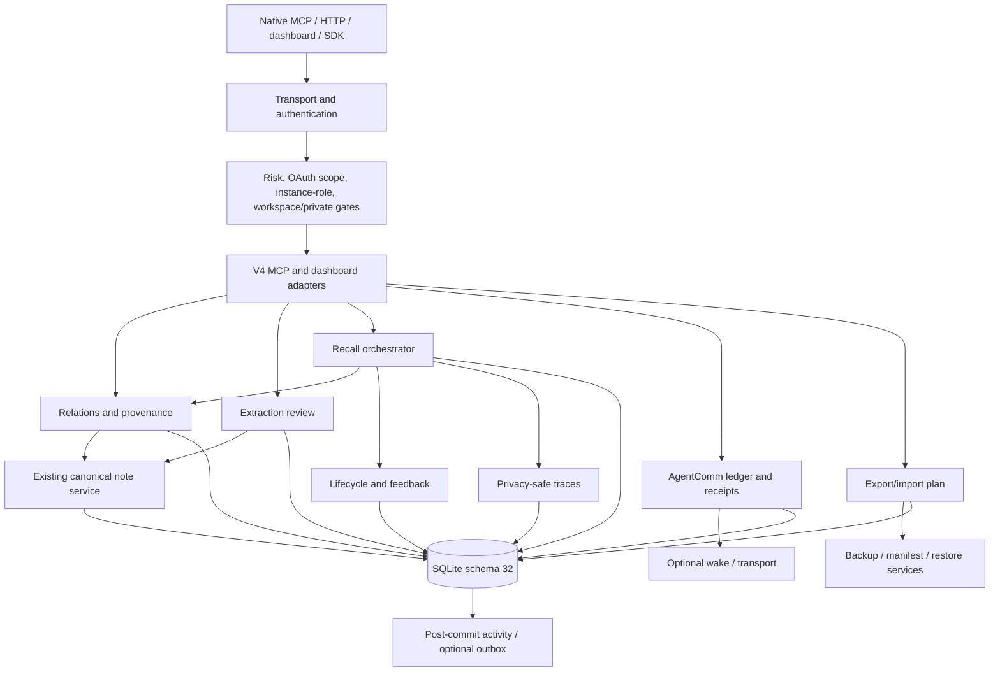
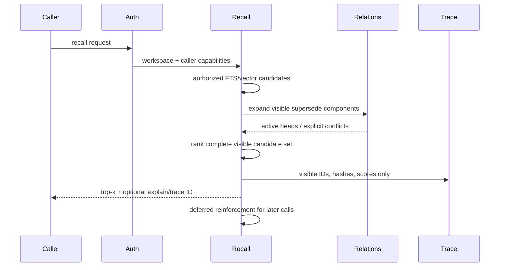
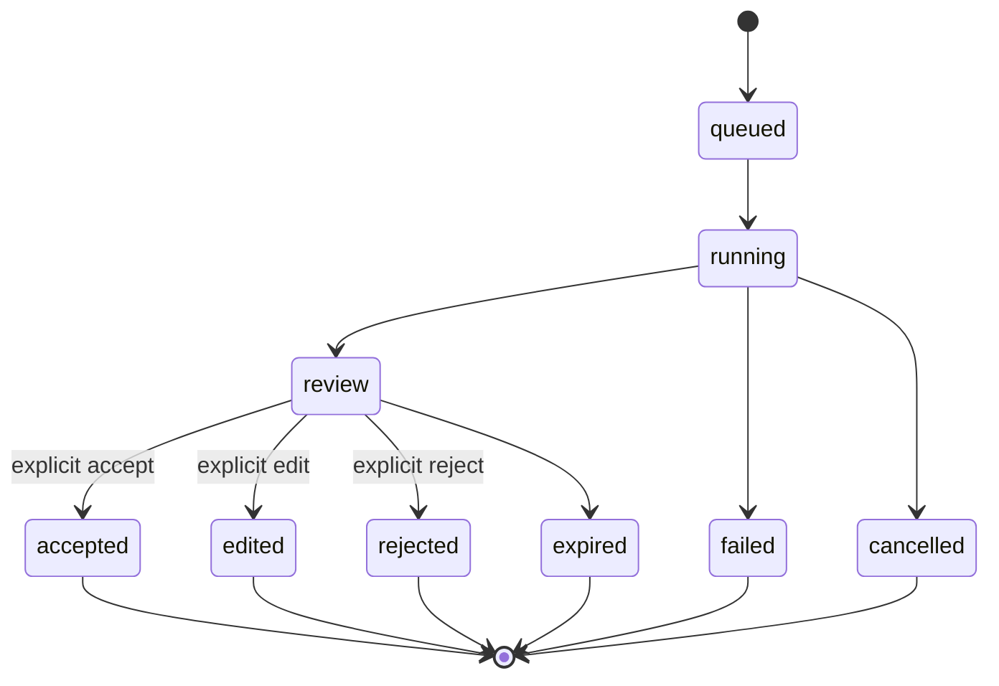

# V4 architecture and module boundaries

## Principles

Qoopia remains the canonical source of truth. Authorization is workspace/private-first. New state is additive and feature-gated. Canonical notes are written only by the existing note service after an explicit authorized action. Delivery acceleration, ranking metadata, diagnostics, export artifacts, and external references never replace their canonical ledgers.

## Runtime dependency graph

Dependencies point inward: transport adapters may call domain services; domain services may call persistence and the existing canonical note service; persistence never calls transport. External delivery and event outbox run after the owning transaction commits.

## Bounded contexts

| Context | Primary implementation boundary | Required invariant |
|---|---|---|
| Relations | `src/services/note-relations.ts` | composite workspace FK, acyclic supersede graph, explicit multiple heads |
| Provenance | `src/services/provenance.ts` | hash-only evidence and source ACL re-check |
| Lifecycle | `src/services/memory-lifecycle.ts` | stored counters/pin only; caller-relative confidence derived from visible provenance; protected records never decay negatively |
| Extraction | `src/services/extraction.ts` | proposal-only; canonical write only after explicit review |
| Recall | existing orchestrator plus `src/services/recall/**` | baseline bypass when flags off; authorized head expansion before top-k |
| Traces/feedback | dedicated services | no raw query or hidden candidate; 30-day trace detach/delete transaction preserves durable feedback |
| AgentComm receipts | `src/services/agent-delivery.ts` | ledger first; idempotent consumer lease; wake not correctness |
| Export/DR | `src/services/export.ts` and V4 scripts | complete signed bundle, plan first, no secret-bearing response |
| Event outbox | `src/services/event-outbox.ts` | post-commit, metadata only, SSRF-safe delivery |
| UI | existing dashboard modules | service ACL parity, no independent authorization logic |

## Critical sequences

### Relation-aware recall

### Reviewed extraction

Only transitions to `accepted` or `edited` invoke the existing canonical note service, within an auditable idempotent transaction.

## Compatibility boundary

Schema 32 is additive. V3 code ignores the new tables. With all V4 flags off, V4 executes the baseline service paths and retains baseline required fields/defaults/envelopes. New tool discovery is additive. The compatibility overlay remains default-off and outside V4 SDK/CLI/docs.
