# Phase and rollout dependency DAG

## Implementation/review DAG

```mermaid
flowchart LR
  P00[P00 PASS b6c169b] --> P01[P01 architecture freeze]
  P01 --> R01[fable-5 P01 PASS]
  R01 --> P02[P02 schema 27-32]
  P02 --> P03[P03 domain]
  P03 --> P04[P04 recall]
  P04 --> P05[P05 MCP / SDK]
  P05 --> P06[P06 AgentComm]
  P06 --> P07[P07 dashboard]
  P07 --> P08[P08 security / export / DR]
  P08 --> P09[P09 qualification]
  P09 --> RC[immutable RC]
  RC --> P10[P10 owner-GO rollout]
```

Every arrow crosses an exact integration SHA, green integration smoke, checkpoint, and independent fable-5 PASS. P03 through P09 consume schema-32 fixtures. P08 binds export/import handlers to the schemas frozen by P01/P05; contract drift returns to P05 review.

## Production rings

| Ring | Surface | Mutation gate | Minimum observation |
|---:|---|---|---|
| 0 | network-isolated production-size clone, flags off/on | none; clone only | complete qualification run |
| 1 | loopback shadow instance on private clone; outbound delivery off | no production mutation | complete runtime smoke |
| 2 | production immutable image, all V4 behavior flags off | owner GO + backup + restart | 24 hours default |
| 3 | read-only explain/dashboard for live-resolved owner/steward capabilities | action-specific GO if config/restart changes | 24 hours default |
| 4 | lifecycle/latest-only for one owner-confirmed live-resolved low-risk canary | action-specific GO | 24 hours default |
| 5 | extraction proposal only, then AgentComm receipt evidence | action-specific GO | 24 hours default |
| 6 | fleet-wide behavior enable | explicit owner GO | agreed release window |

No ring starts until the prior ring artifact has fable-5 PASS. A shorter observation window requires an owner decision bound to the exact deployed SHA and current metrics.

## Stop and rollback

Security/data/compatibility failure, health regression, legacy coverage loss, SLO breach, duplicate side effect, unexplained hash drift, or missing evidence stops progression. Rollback order is flags off, previous immutable image, compatibility/health verification, then database restore only for proven corruption under separate GO.
